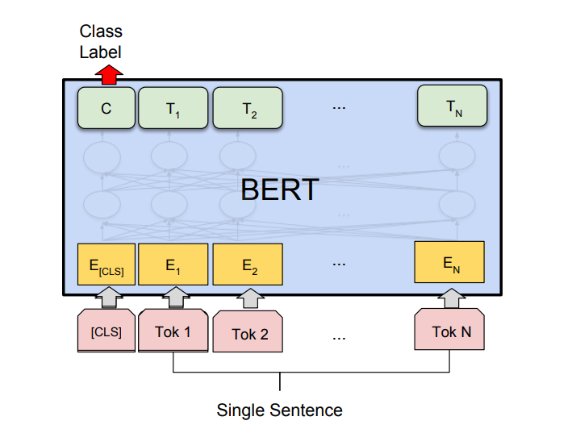

# Fine-tuned-BERT-model-to-perform-sentiment-analysis
Text classification task in Natural Language Processing (NLP) that involves categorizing a piece of text, into defined sentiment categories, such as positive, negative, or neutral.

BERT is a type of transformer-based architecture that can capture the meaning of a sentence by considering the context in which each word appears.

We can fine-tune a pre-trained BERT model on a labeled sentences dataset with their corresponding sentiment categories to use BERT for sentence classification. The fine-tuning process involves training the BERT model on our specific task by feeding it our labeled dataset and adjusting its parameters to improve its performance.

BERT model that has already been fine-tuned on the Stanford Sentiment Treebank (SST-2). The model and the dataset are available online:

[Model](https://huggingface.co/jap2/bert-base-sst-2)
[Dataset](https://huggingface.co/datasets/glue/viewer/sst2/test)

